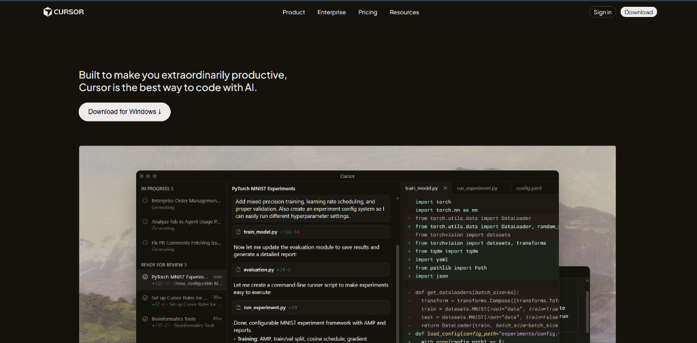

# Cursor Landing Page Clone

A static HTML and CSS recreation of the Cursor marketing site, built as a front-end layout exercise.



## Features
- Fixed navigation with product links and CTA buttons
- Hero section with download CTA and product image
- Trust logos grid
- Alternating feature callouts with large visuals
- Testimonials grid with author profiles
- Use case cards
- Changelog cards
- About section, highlights list, final CTA, and footer

## Tech Stack
- HTML5
- CSS3
- Google Fonts (Plus Jakarta Sans)

## Project Structure
```
.
├── index.html
├── styles.css
├── README.md
└── assets/
    ├── LOCKUP_HORIZONTAL_2D_DARK.svg
    ├── hs1img.png
    ├── feature-section-1.png
    ├── feature-section-2.png
    ├── feature-section-3.png
    ├── usecase-1.png
    ├── usecase-2.png
    ├── usecase-3.png
    ├── about-image.webp
    ├── author.jpg
    ├── andrej.png
    ├── diana-hu.png
    ├── greg.png
    ├── patrick.png
    ├── primeagen.png
    └── shadcn.png
```

## Getting Started
1. Clone or download this repository
2. Open `index.html` in your browser
3. No build tools or dependencies required

## Notes
- Images are stored in the assets folder and referenced directly from the HTML
- External logo images (trusted companies section) are pulled from public URLs
- Responsive design with fixed navigation bar
- CSS uses custom properties (CSS variables) for consistent theming

## Credits
Page layout inspired by the Cursor marketing site. This project is for educational practice only.
